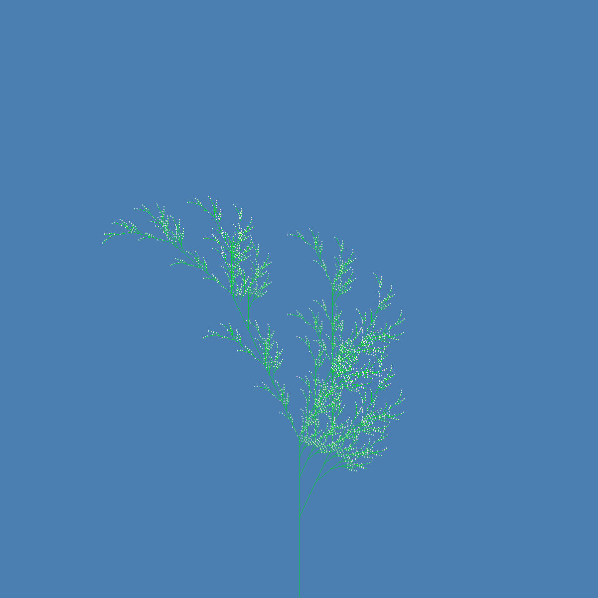
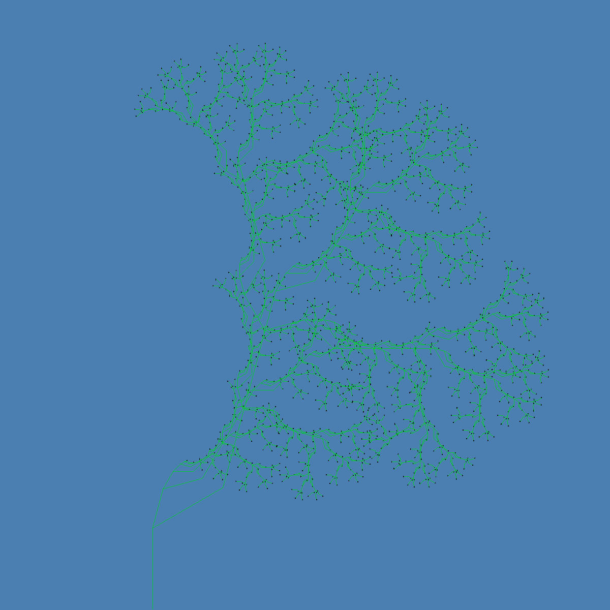
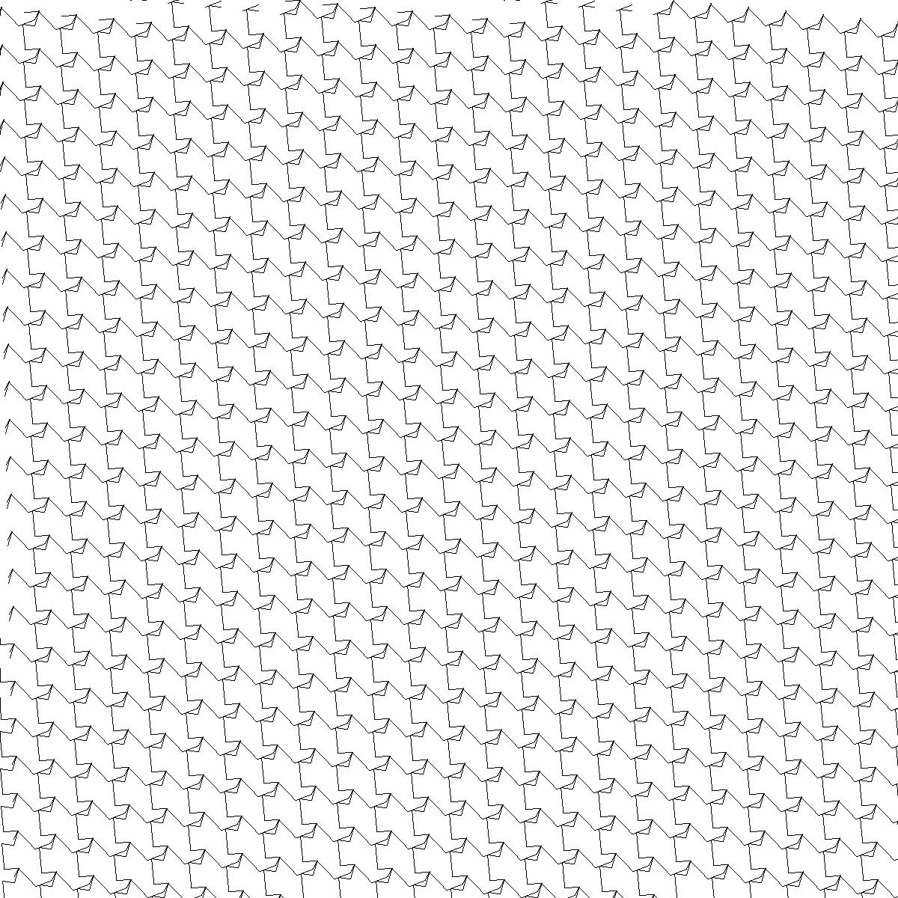
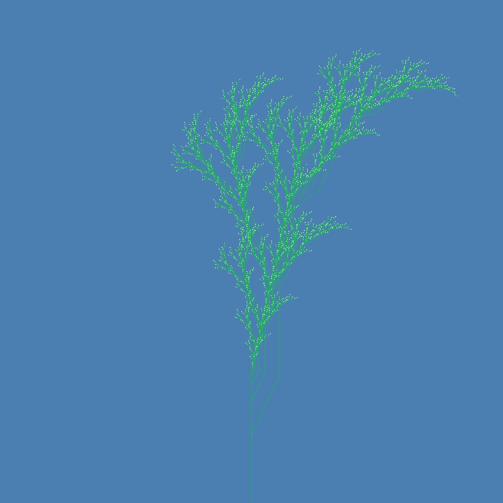
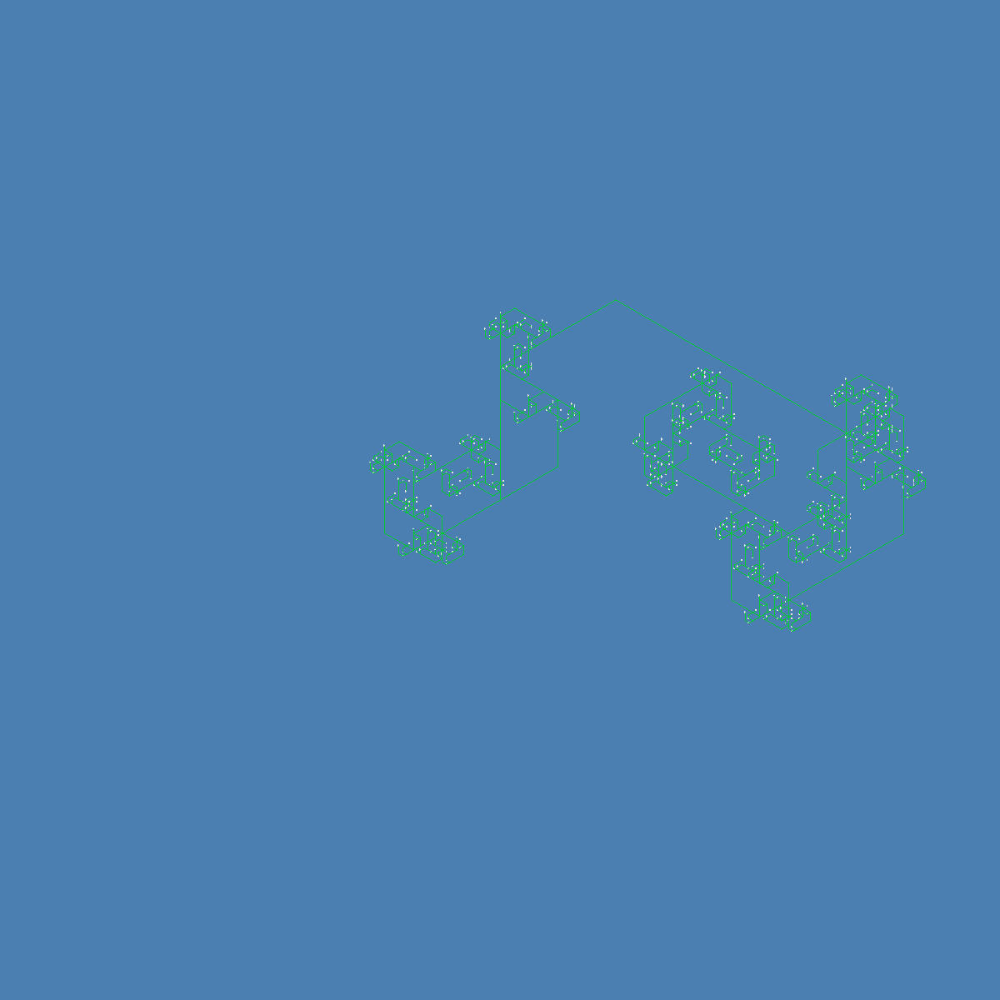
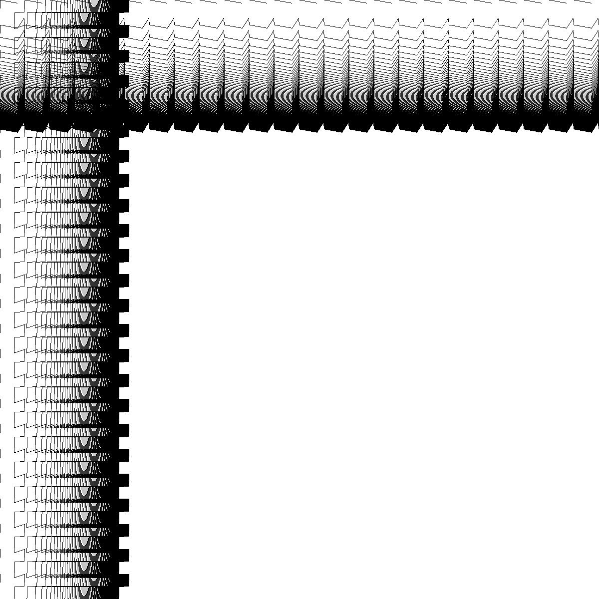

# Mireba (見れば)

The skeleton of a photorealistic renderer built from the ground up in rust.

Based on Mitsuba and PBRT.

There's still a lot to be done.

<!--
# Outputs

-->

## Name

Mitsuba （三つ葉）一文字変えれば「見れば」になる。

If you change one character in Mi-tsu-ba, you get Mi-re-ba.
This renderer's general design is based off of
[Mitsuba](https://github.com/mitsuba-renderer/mitsuba2), so I thought it was fitting.
Also mireba means "if you can see", and hopefully Mireba will help you see virtual scenes.
