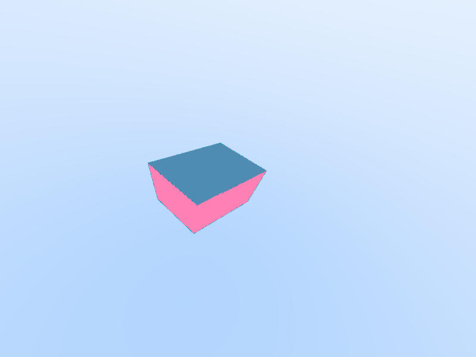

# Ray Weekend

A raytracer initially built off the raytracer in a weekend file. I've added additional features
including different objects, indexed triangle lists, and hopefully more as time goes on.

# TODO

- Implement some random generator for objects
- Fix noise by implementing a better sampling strategy
- More materials and fix existing API
- Better sampling strategy for reflections
- Add lights rather than just ambient
- Add fluids

# Outputs

